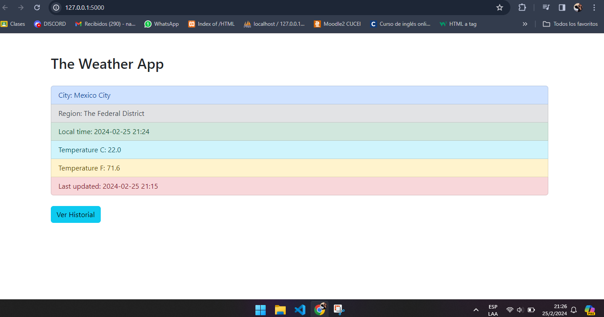
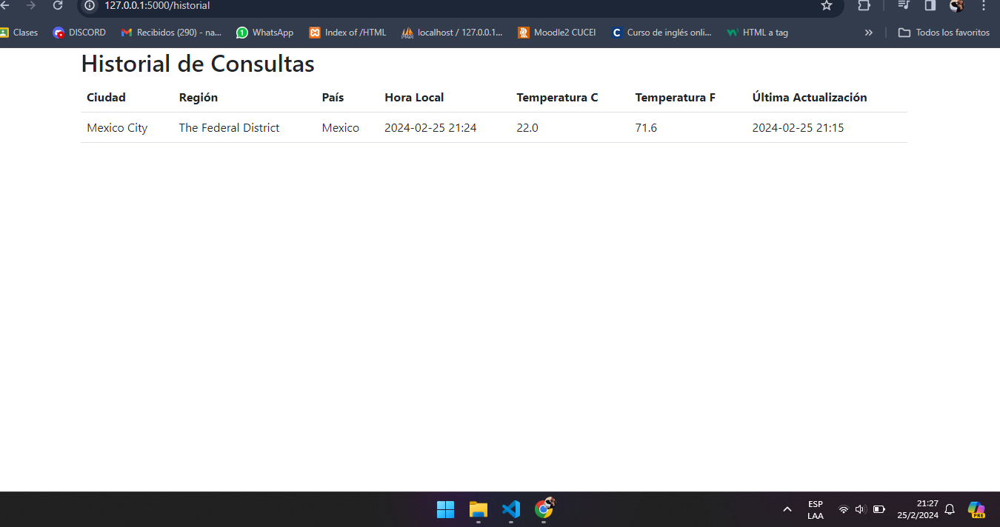

## Therading
Es una aplicación basica web, en la que se utiliza flask y python para construirla.

### Need to know
- "getWeather" se encarga de realizar una solicitud a una API, de pronostico del tiempo, y procesa la respuesta.
-"hello_world" inicia un nuevo hilo(weatherThread), que llama a la función "getWeather" para obtener los datos del clima
- Go to `http://127.0.0.1:5000`
- "historial"l se encarga de reedirigirnos a todas las consultas anteriores del clima en la pagína 
