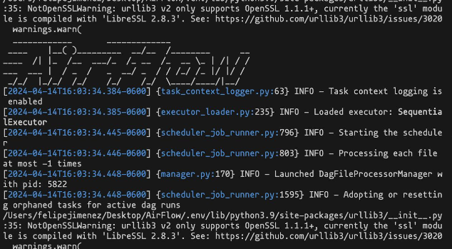
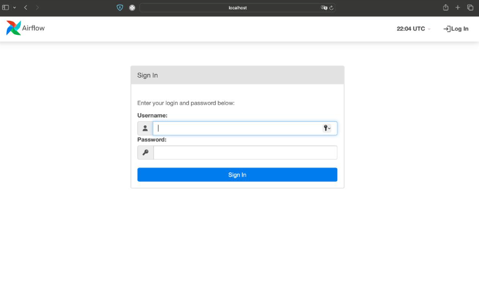
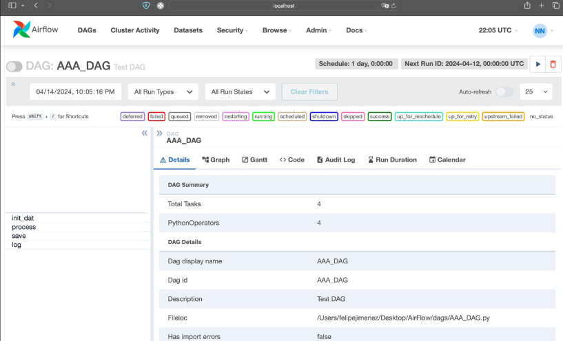
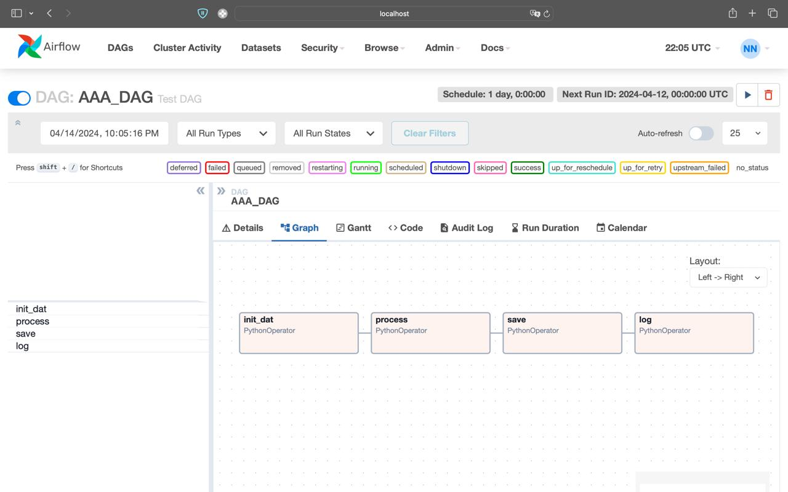
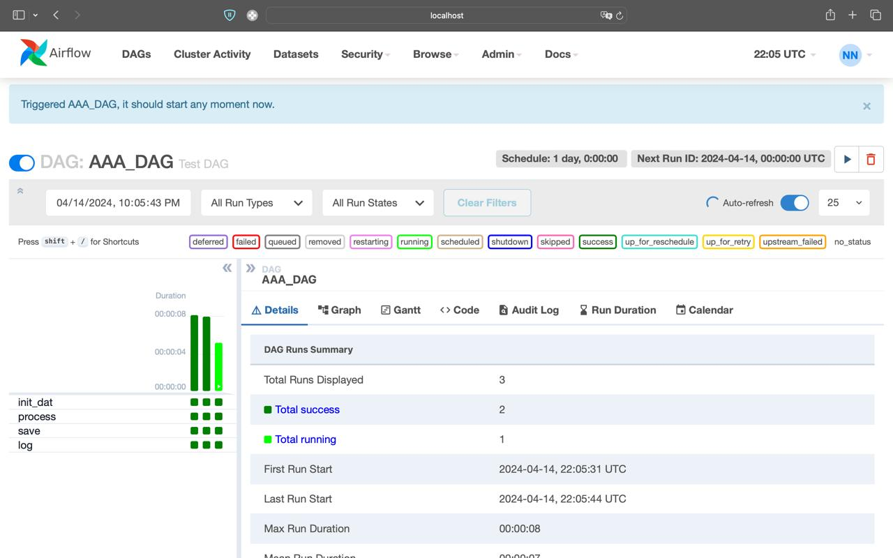

**Introducción**

Apache Airflow es una plataforma de planificación de flujos de trabajo de código abierto ampliamente utilizada en ingeniería de datos.

**Desarrollo**

Apache Airflow comienza en 2015, en las oficinas de AirBnB. En ese momento, la plataforma de alquileres vacacionales fundada en 2008 experimentó un enorme crecimiento y se estaba desmoronando bajo un volumen de datos cada vez mayor.

**¿Para que se utiliza?**

1. Programación de tareas: Airflow permite definir flujos de trabajo complejos como flujos de tareas dirigidos por dependencias. Puedes definir tareas individuales y sus relaciones de dependencia en un lenguaje declarativo

2. Programación distribuida y paralela: Permite la ejecución de tareas en paralelo, lo que permite un procesamiento más rápido y eficiente de grandes flujos de datos.

3. Monitoreo y administración: Airflow proporciona un panel de control web donde los usuarios pueden monitorear el progreso de sus flujos de trabajo, ver el estado de las tareas individuales, ver el historial de ejecución y obtener información detallada sobre el rendimiento.

4. Reprogramación dinámica: Permite la reprogramación dinámica de flujos de trabajo, lo que significa que puedes ajustar y reprogramar tareas en función de eventos externos o cambios en los requisitos comerciales.

5. Integración con diferentes sistemas: ofrece conectores integrados para una amplia gama de sistemas y tecnologías, incluidos sistemas de almacenamiento de datos (como Hadoop, AWS S3, Google Cloud Storage), bases de datos (como MySQL, PostgreSQL), servicios en la nube (AWS, Google Cloud, Azure), herramientas de monitoreo (como Datadog, StatsD) y más. 

6. Programación basada en código: permite definir flujos de trabajo utilizando código Python.

7. Control de errores y reintentos: Airflow proporciona mecanismos para controlar errores y reintentar tareas automáticamente en caso de fallos.

**Instalación**

Comandos para instalación:

Instalación por medio de PIP:

pip install apache-airflow

**Inicializar la db**

 Se debe inicializar la base de datos de Airflow. Airflow utiliza una base de datos para gestionar sus metadatos y programación. Podemos elegir entre SQLite, PostgreSQL, MySQL, o MSSQL. Comando utilizado para inicializar la base de datos con SQLite:

airflow db init

**inicializar el webserver de Airflow**

airflow webserver --port 8080
airflow webserver --port 8080

